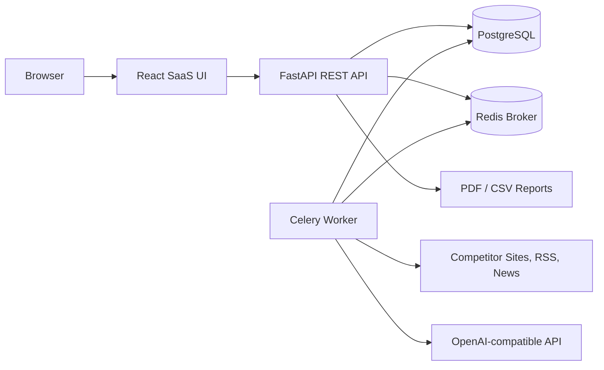

# Competitor Intelligence Platform

A production-minded MVP for monitoring competitors, collecting web and news signals, detecting changes, and generating AI-powered market intelligence reports.

The frontend is themed as **Market Quest**, a retro pixel-art strategy dashboard inspired by handheld game interfaces.

## Highlights

- Next.js 15, TypeScript, Tailwind CSS, shadcn-style UI primitives, Framer Motion, and Lucide frontend
- FastAPI, SQLAlchemy, PostgreSQL backend
- JWT authentication and protected routes
- BeautifulSoup, Requests, Newspaper3k, RSS monitoring
- Celery background scan jobs with Redis
- OpenAI-compatible insight generation with deterministic demo fallback
- PDF and CSV report generation
- Docker Compose setup for app, database, Redis, API, worker, and frontend
- Seed dataset for OpenAI, Anthropic, Perplexity, and Notion

## Architecture



## Quick Start

1. Copy environment variables:

```bash
cp .env.example .env
```

2. Start the stack:

```bash
docker compose up --build
```

3. Seed demo data:

```bash
docker compose exec backend python -m app.seed
```

4. Open:

- Frontend: http://localhost:3000
- API docs: http://localhost:8000/docs

Demo login after seeding:

- Email: `demo@competitorintel.dev`
- Password: `DemoPass123!`

## Local Development

Backend:

```bash
cd backend
python -m venv .venv
source .venv/bin/activate
pip install -r requirements.txt
uvicorn app.main:app --reload
```

Frontend:

```bash
cd frontend
npm install
npm run dev
```

## Environment

See [.env.example](.env.example) for all settings.

Important variables:

- `DATABASE_URL`
- `SECRET_KEY`
- `OPENAI_API_KEY`
- `OPENAI_BASE_URL`
- `OPENAI_MODEL`
- `REDIS_URL`

## API Documentation

FastAPI automatically publishes OpenAPI docs at `/docs`.

Main resources:

- `POST /api/auth/register`
- `POST /api/auth/login`
- `GET /api/dashboard`
- `GET /api/competitors`
- `POST /api/competitors`
- `POST /api/competitors/{id}/scan`
- `GET /api/news`
- `GET /api/insights`
- `POST /api/insights/generate`
- `GET /api/reports`
- `POST /api/reports`
- `GET /api/analytics/activity`
- `GET /api/search?q=...`

## Screenshots

Add screenshots to `docs/screenshots/` after running the app:

- `dashboard.png`
- `competitors.png`
- `insights.png`
- `reports.png`

## Portfolio Notes

This MVP is designed to show full-stack product judgment:

- Clean API boundaries and typed schemas
- Real data model with historical snapshots and changes
- Background automation architecture
- AI integration that degrades gracefully without paid credentials
- SaaS interface with dashboards, filters, dark mode, charts, and reports
